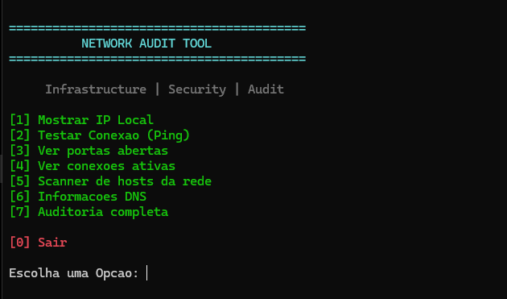
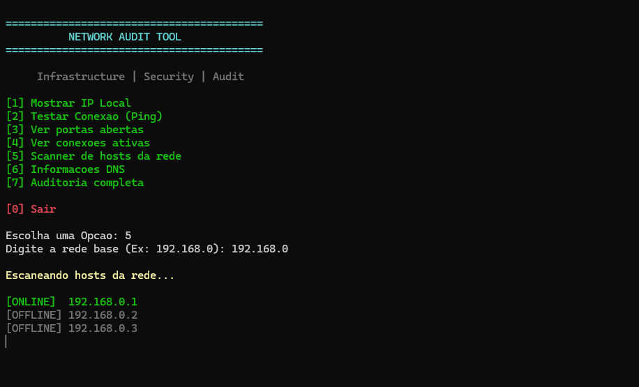
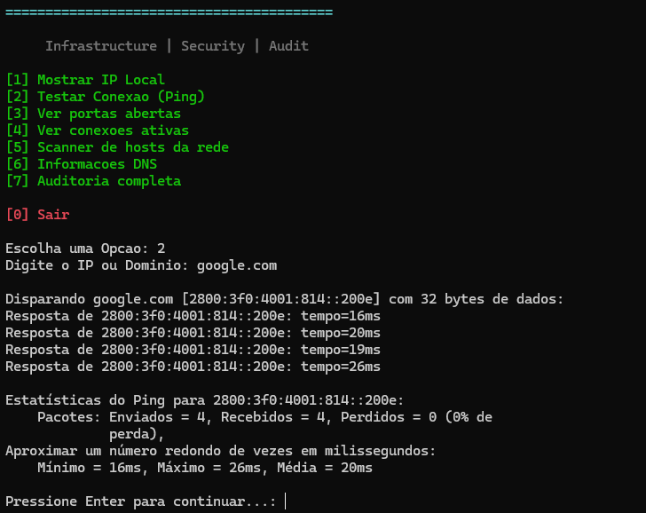

# Network Audit Tool

Ferramenta simples desenvolvida em PowerShell para auditoria básica de rede, diagnóstico e análise de infraestrutura.

---

## Funcionalidades

* Exibição do IP local
* Teste de conectividade (Ping)
* Verificação de portas abertas
* Visualização de conexões ativas
* Scanner simples de hosts na rede
* Consulta DNS
* Auditoria completa da rede

---

## Tecnologias Utilizadas

```powershell id="ln1vzs"
PowerShell
Netstat
Ping
NSLookup
TCP Connections
```

---

## Menu

```txt id="7yujn4"
=========================================
          NETWORK AUDIT TOOL
=========================================

   Infrastructure | Security | Audit            

[1] Mostrar IP local
[2] Testar conexão (Ping)
[3] Ver portas abertas
[4] Ver conexões ativas
[5] Scanner de hosts
[6] Consulta DNS
[7] Auditoria completa

[0] Sair
```

---

## Objetivo

Este projeto foi desenvolvido com foco em:

* Infraestrutura
* Redes
* Segurança da Informação
* Administração de Sistemas
* Automação com PowerShell

---

## Screenshots

As capturas de tela e evidências do projeto podem ser encontradas na pasta `/screenshots`.

---

## Observação

Ferramenta desenvolvida exclusivamente para fins educacionais e estudos relacionados à auditoria e análise de rede.

## Capturas de Tela




